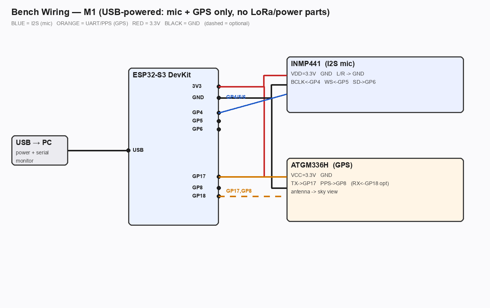

# 🔊 acoustic-triangulation

> **DIY ShotSpotter for your property.** GPS-synchronized microphone nodes triangulate loud transients (gunshots, backfires, whatever goes boom) and pin the source on a map — no cloud, no subscription, ~$230 in parts.



---

## How it works

Four solar-powered sensor nodes sit at the corners of the property. A fifth node lives indoors, doubles as the LoRa gateway, and feeds a Raspberry Pi.

When something loud happens, every node that hears it records the exact microsecond of arrival — disciplined to GPS PPS (the 1-pulse-per-second signal), which gives all nodes a common timebase accurate to <1 µs for free. Each node fires off a tiny 20-byte LoRa packet:

```
{ node_id, lat, lon, onset_time_µs, amplitude, classification }
```

The Pi collects the packets, computes **Time Difference of Arrival (TDoA)** across the nodes, and solves for the source location. Result: a dot on a Leaflet/OpenStreetMap web map, updated in real time.

**Expected accuracy:** 5–15 m. Dominated by GPS position error and node geometry, not timing.

---

## Why GPS PPS and not NTP / LoRa timing?

Sound travels ~34 cm per millisecond. NTP is good to ~10 ms → **3.4 m of timing error per ms**. LoRa is even slower and jittery. GPS PPS is <1 µs → sub-centimeter timing contribution. It's the only viable approach for outdoor acoustic TDoA at this scale.

LoRa is used **only** to ship the tiny detection report after the fact. It has nothing to do with timing.

---

## Hardware

### Field node ×4 (solar, weatherproof, one per corner)

| Part | ~$ |
|---|---|
| ESP32-S3-Zero (dual-core LX7, 2 MB PSRAM) | 4.50 |
| INMP441 I²S MEMS microphone | 1.80 |
| RYLR689 LLCC68 915 MHz LoRa (SPI) | 9.00 |
| ATGM336H GPS with PPS pin | 4.50 |
| 6 V / 5 W solar panel | 8.00 |
| CN3791 MPPT solar charger | 3.00 |
| 18650 Li-ion cell + holder | 5.00 |
| IP65 ABS enclosure | 4.50 |
| Acoustic vent (PTFE membrane) | 1.50 |
| Misc wire / JST / mount | 5.00 |
| **Per node** | **~$47** |

### Office node ×1 (mains, USB-powered from Pi)

Same sensor stack, no solar/battery. Active external GPS antenna for indoor sky-view. Also acts as the LoRa gateway.

### Base station

Raspberry Pi (any model with USB) + the office node + a browser. No cloud. No API key. Leaflet + OpenStreetMap.

**Full BOM with sourcing notes and buy links → [BOM.md](BOM.md)**

**Detailed power budget, solar sizing, and low-power DS3231 holdover variant → [POWER.md](POWER.md)**

---

## Repo layout

```
firmware/          PlatformIO project — ESP32-S3 node firmware
  src/
    acoustic_core.h   timing engine (GPS-PPS + I²S DMA ring + onset detector)
    node_config.h     pin map + node ID (edit per node)
    main_stageN.cpp   staged build environments (mic → GPS → onset → full node)
  platformio.ini

base/
  base_station.py   LoRa RX → TDoA solver → Leaflet map (Flask)
  test_solver.py    unit tests for the multilateration math
  requirements.txt

BOM.md             Full bill of materials with sourcing
POWER.md           Power budget, solar sizing, battery autonomy, DS3231 holdover
WIRING.md          Pin-by-pin wiring for S3-Zero + all modules
POC.md             Proof-of-concept plan (USB-powered bench test first)
NODE_FIRMWARE_DESIGN.md  Detailed firmware architecture
FIELD_TEST.md      Field deployment checklist
```

---

## Firmware quick-start

Requires **PlatformIO** and the **pioarduino** platform (Arduino core 3.x — the new `i2s_std.h` driver needs it; stock espressif32 core 2.x won't compile).

```bash
cd firmware

# Stage 1 — mic level meter (sanity check before wiring everything)
pio run -e stage1 -t upload -t monitor

# Stage 2 — GPS lock + PPS pulse counter
pio run -e stage2 -t upload -t monitor

# Stage 3 — onset detection + PPS timestamp
pio run -e stage3 -t upload -t monitor

# Stage 4 — full node (onset → LoRa TX)
pio run -e stage4 -t upload -t monitor

# Stage 5 — base RX + sync check (run on office node / DevKit)
pio run -e stage5 -t upload -t monitor
```

Edit `src/node_config.h` to set `NODE_ID` (0–4) and verify pin assignments before flashing each node.

> **Gotcha:** the S3FH4R2 chip has 4 MB flash but the default board profile assumes 8 MB → bootloop. `platformio.ini` already sets `board_upload.flash_size=4MB` and `board_build.flash_size=4MB`. Don't remove those lines.

---

## Base station quick-start

```bash
cd base
pip install -r requirements.txt

# Sanity-check the solver math (runs without hardware)
python test_solver.py

# Start the gateway + map server
# Office node must be plugged in via USB
python base_station.py --port /dev/ttyUSB0 --map-port 5000
```

Open `http://localhost:5000` — events appear as pins on the map as they arrive.

---

## Node placement

Property is ~52 m × 155 m (long and narrow). **Do not line nodes along the centerline** — colinear geometry kills cross-width accuracy. Stagger them in a zigzag/W pattern, pushing to the extreme corners, so you get perpendicular baselines in both axes.

```
N1 ──────────────────── N2
 \                      /
  \    (office node)   /
   N5                 /
  /                  /
N3 ──────────────────── N4
```

Every node hears every event on this lot → over-determined system → ambiguity rejection works.

---

## Accuracy

| Error source | Contribution |
|---|---|
| GPS PPS timing | <1 µs → <0.3 mm |
| GPS position error (single-point) | ~2–5 m |
| Node geometry (52 m narrow axis) | limits cross-width to a few meters |
| Speed of sound variation (temp/wind) | ~1–3 m in practice |
| **Combined** | **~5–15 m** |

The timing is not the limiter. Node position error and geometry are. Sub-meter accuracy requires tape-survey + hardcoded positions.

---

## Cost

| Group | Cost |
|---|---|
| 4 solar field nodes | ~$189 |
| 1 mains office node | ~$28 |
| Base (Pi on hand) + microSD | ~$6 |
| Bench dev kit | ~$8 |
| **Total** | **~$231** |

Commercial ShotSpotter: $50,000–$100,000 per square mile. Just saying.

---

## License

MIT
